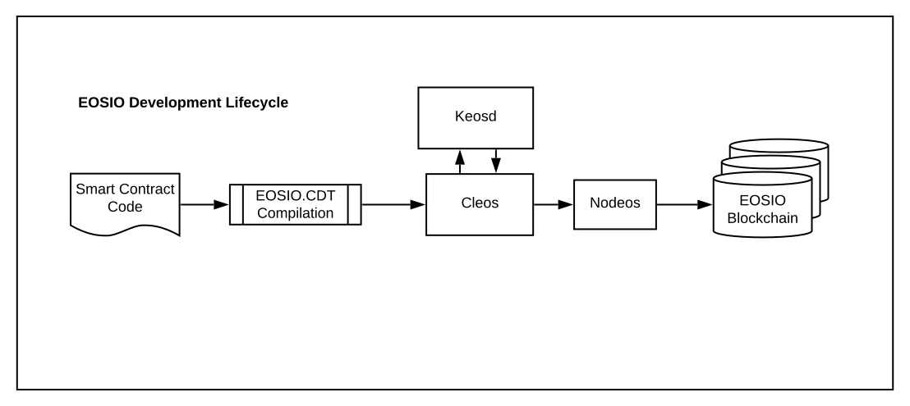

The Antelope framework provides a number of components and libraries which are used to operate blockchain nodes, collect blockchain data, to interact with these nodes, and to build smart contracts. The main component is `nodeos` (node + Antelope = nodeos). This is the core Antelope node daemon that can be configured with plugins to run a node. Example uses are block production, dedicated API endpoints, and local development. `Cleos` (CLI + Antelope = cleos) is a command line interface which interacts with `nodeos`, allowing you to send commands and actions to a blockchain. `Cleos` also interacts with `keosd` (key + Antelope = keosd), a local component that securely stores Antelope keys.     

To build smart contracts you require `Antelope CDT`, the Block.one developed toolchain and libraries, which generate the `WebAssembly` binary instructions or `bytecode` into `wasm` files. The generated `wasm` files are the smart contracts which can be deployed to Antelope blockchains.

The basic relationship between these components is illustrated in the following diagram:

[[info | Note]]
| Antelope also provides a frontend library for javascript development called EOSJS along with Swift and Java SDKs for native mobile applications development.

## Nodeos

Nodeos is the core Antelope node daemon. Nodeos handles the blockchain data persistence layer, peer-to-peer networking, and contract code scheduling. For development environments, nodeos enables you to set up a single node blockchain network. Nodeos offers a wide range of features through plugins which can be enabled or disabled at start time via the command line parameters or configuration files.

You can read detailed documentation about `nodeos` [here](https://developers.eos.io/manuals/eos/v2.2/nodeos/index).
<!-- The link will be updated once the initial site is live -->

## Cleos

`cleos` is a command line tool that interfaces with the REST APIs exposed by `nodeos`. You can also use `cleos` to deploy and test Antelope smart contracts.

You can read detailed documentation about `cleos` [here](https://developers.eos.io/manuals/eos/v2.2/cleos/index).
<!-- The link will be updated once the initial site is live -->

## Keosd

`keosd` is a key manager daemon for storing private keys and signing digital messages. `keosd` provides a secure key storage medium for keys to be encrypted in the associated wallet file. The `keosd` daemon also defines a secure enclave for signing transaction created by `cleos` or a third party library.

[[info | Note]]
| `keosd` can be accessed using the wallet API, but it is important to note that the intended usage is for local light client applications. `keosd` is not for cross network access by web applications trying to access users' wallets.

You can read detailed documentation about `keosd` [here](https://developers.eos.io/manuals/eos/v2.2/keosd/index).
<!-- The link will be updated once the initial site is live -->

## Antelope CDT
Antelope CDT is a toolchain for WebAssembly (Wasm) and a set of tools to facilitate contract writing for the Antelope framework. In addition to being a general-purpose WebAssembly toolchain, EOSIO-specific optimizations are available to support building Antelope smart contracts. This new toolchain is built around Clang 7, which means that Antelope CDT has most of the current optimizations and analyses from LLVM.

## EOSJS
A Javascript API SDK for integration with EOSIO-based blockchains using the Antelope RPC API.
