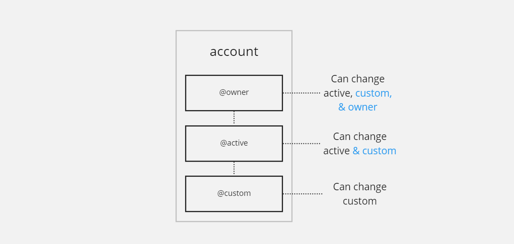
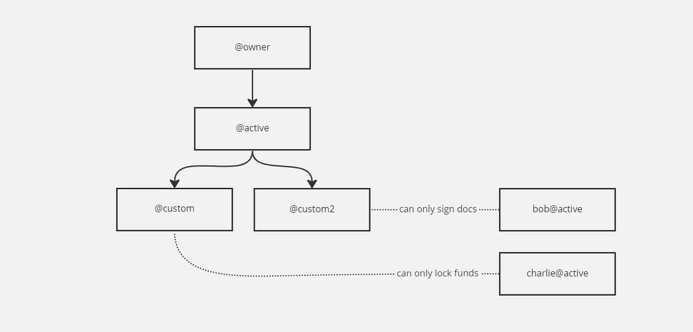
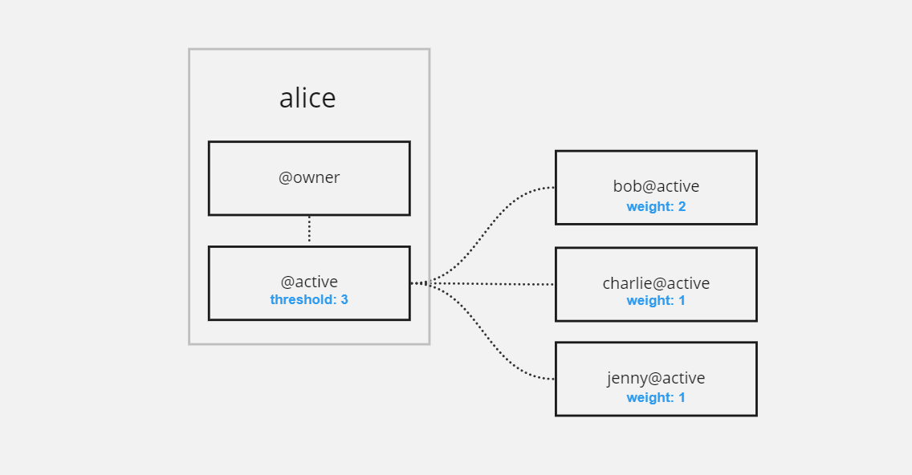

On the EOS Network an account is a digital container. This digital container holds information, such as:
* EOS tokens owned by the account
* Resources at its disposal
* An account control permission structure
* A smart contract

Use an account to access and control your blockchain data and execute transactions.

## Account names

Every account on the EOS Network has a human-readable name. This makes it easier to identify transaction recipients and smart contracts. To keep account names efficient on the blockchain, a few restrictions apply to all names: 

* All characters must be lowercase
* Every name must be 12 characters long (or less with a suffix/premium name)
* Names can only contain letters `a-z`, numbers `1-5`, and period (`.`) 
* Names cannot start with a number or a period. 
* Names cannot end with a period.

Periods have a special meaning for EOS accounts. They specify that an account has a **suffix** (similar to a top-level domain like .com), also known as a **premium name**. Only the **suffix owner** can create an account with a suffix.

For instance, if someone owns the suffix `.bar` then only that person can create `foo.bar`. 

Refer to the Name Bidding system in this guide for more information. Thgis sysem allows someone on the EOS network to purchase premium names.

## Public/private keys

A public/private key pair controls every EOS account. An account uses the private key to sign transactions and must be kept confidential. The public key identifies the account on the blockchain and can be publicly known.

Safeguard your private key. It provides complete control over your account's digital assets. Store your private key in a secure software or hardware wallet. Whoever possesses the private key has full access to the assets linked to your account.

EOS accounts offer extra security out of the box using the *permission system*

Examples of private and public keys: 
```
Private: 5KSdyAiFzYQAtBKDBKCCF28KMMhZ4EmXUxSg8B3nSkHKutT15rY
Public: PUB_K1_5d7eRKgCCiEdsbBdxxnZdFWnGYS64uWZPZgTcTU1xnB2aESxqR
Legacy Public Format: EOS5d7eRKgCCiEdsbBdxxnZdFWnGYS64uWZPZgTcTU1xnB2cq4JMD
```

## Permissions system

Each account has a set of hierarchical permissions that control what that account can do. By default, each account has two base permissions. Your account requires these two permissions for it to function properly. You cannot remove them.

The mandatory permissions are `owner` and `active`.

A permission can only change its parent (keys or accounts) or what controls its children. It can never change what controls its parent.




Either a public key or another `account@permission` controls a permission. A public key is registered on chain and is controlled by its associated private key. This structure allows you to create complex account control structures. Multiple parties may have control over a single account. Each of these parties also has full autonomy over their own account's security. b

View the following example diagram. Accounts `bob` and `charlie` both control `alice`. The account `tom` controls `Charlie`. Keys control all accounts.


You can add custom permissions under `active`. A custom permission allows you to limit access to only a specific contract's action. A specific contract's action is also known as a callable function. The custom permission is only able to interact with the contract action you specify.

You are able to create granular access permissions across accounts. These accounts can have hierarchical ownership and usage.





Most importantly, the permission system has built-in support for multi-signature transactions (transactions that require multiple parties to sign them). Every linked account or key associated with a permission has a **weight** assigned to it, and the permission itself has a **threshold**. 

As you can see in the example below, `bob` alone does not have enough power to sign using the `active` permission. He needs either `charlie` or `jenny` to co-sign with him for any transaction that `alice@active` makes. `charlie` and `jenny` cannot sign a transaction alone, they need `bob`. 





## Smart contracts

A smart contract is a program that runs on the blockchain. 
Use a smart contract to add functionality to an account. The functionality can range from simple to complex. A simple feature may be a todo application. A complex feature may be an RPG game running entirely on the blockchain.

Every account can have one smart contract deployed to it. That smart contract can be updated at any time.

Refer to our [DUNE Guide](./10_dune-guide.md) for more information about deploying smart contracts to your accounts.


## Create an account with DUNE

After **DUNE** is set up, you can start creating accounts. You can use a single command to create an account on your local development environment.

```shell
dune --create-account <ACCOUNT_NAME>
```

To view information related to your account, use the following command:

```shell
dune -- cleos get account <ACCOUNT_NAME>
```


## Ownership of digital assets

A digital asset is data owned by an account and stored on the blockchain. **Ownership** defines a relationship where a digital asset belongs to a specific account. Only the specific account can manipulate, transfer, or otherwise control that digital asset.

A smart contract also co-owns that digital asset with the account. The smart contract may be able to manipulate all assets stored in its tables without consent of the user.

Smart contract developers can update smart contracts at will. Smart contracts with security or financial implications may give up their ability to update. They may trade updatability for increased user trust.


## Relinquishing ownership of an account

Upgradeability has significant benefits for smart contract development. 

To give up a smart contract’s upgradability, use a NULL or Prods account.


### NULL account

A `NULL` account has no private key or owner. Set the contract account's owner and active permissions to `eosio.null@active`.

The `NULL` account is a good option if. you want to relinquish control of this account **forever**.


```
dune -- cleos set account permission <ACCOUNT> active '{"threshold":1,"keys":[],"accounts":[{"permission":{"actor":"eosio.null","permission":"active"},"weight":1},{"permission":{"actor":"<ACCOUNT>","permission":"eosio.code"},"weight":1}],"waits":[]}' owner -p <ACCOUNT>
dune -- cleos set account permission <ACCOUNT> owner '{"threshold": 1, "keys":[], "accounts":[{"permission":{"actor":"eosio.null","permission":"active"},"weight":1}], "waits":[] }' -p <ACCOUNT>@owner
```

(Notice the `eosio.code` addition for the `active` permission. You might need it if the account is a smart contract!)

### Prods accounts

Prods accounts are different types of producer-controlled (network consensus-controlled) accounts. If you have an issue with this contract, you can request help from the producers to upgrade the contract.

Set the contract account’s `owner` and `active` permissions to one of the following:

* `eosio.prods`
* `prod.major`
* `prod.minor`

Prods accounts are a good option when working with intricate and complex contracts. These contracts may have bugs that negatively impact users. 

#### eosio.prods

The `eosio.prods` account is an account controlled by ⅔+1 of the actively producing producers on the network. It requires a specific number of active producers to sign off on all upgrades. If there are 21 active producers you would 15 of them to sign off on all upgrades. 

```
dune -- cleos set account permission <ACCOUNT> active '{"threshold":1,"keys":[],"accounts":[{"permission":{"actor":"eosio.prods","permission":"active"},"weight":1},{"permission":{"actor":"<ACCOUNT>","permission":"eosio.code"},"weight":1}],"waits":[]}' owner -p <ACCOUNT>
dune -- cleos set account permission <ACCOUNT> owner '{"threshold": 1, "keys":[], "accounts":[{"permission":{"actor":"eosio.prods","permission":"active"},"weight":1}], "waits":[] }' -p <ACCOUNT>@owner
```

#### prod.major

The `prod.major` account is an account controlled by by ½+1 actively producing producers on the network. It requires a specific number of active producers to sign off on all upgrades. If there are 30 active producers you need 16 of them to sign off on all upgrades.


```
dune -- cleos set account permission <ACCOUNT> active '{"threshold":1,"keys":[],"accounts":[{"permission":{"actor":"prod.major","permission":"active"},"weight":1},{"permission":{"actor":"<ACCOUNT>","permission":"eosio.code"},"weight":1}],"waits":[]}' owner -p <ACCOUNT>
dune -- cleos set account permission <ACCOUNT> owner '{"threshold": 1, "keys":[], "accounts":[{"permission":{"actor":"prod.major","permission":"active"},"weight":1}], "waits":[] }' -p <ACCOUNT>@owner
```

#### prod.minor

The `prod.minor` account is an account controlled by ⅓+1 actively producing producers on the network. It requires a specific number of active producers to sign off on all upgrades. If thee are 30 active producers you need 11 of them to sign off on all upgrades.


```
dune -- cleos set account permission <ACCOUNT> active '{"threshold":1,"keys":[],"accounts":[{"permission":{"actor":"prod.minor","permission":"active"},"weight":1},{"permission":{"actor":"<ACCOUNT>","permission":"eosio.code"},"weight":1}],"waits":[]}' owner -p <ACCOUNT>
dune -- cleos set account permission <ACCOUNT> owner '{"threshold": 1, "keys":[], "accounts":[{"permission":{"actor":"prod.minor","permission":"active"},"weight":1}], "waits":[] }' -p <ACCOUNT>@owner
```

## Account creation costs

Someone who already has an account needs to create an account for you. EOS accounts have resources, such as permissions and resources, registered to them. These permissions and resources (CPU,NET, RAM) incur
 a cost when creating them on the network. Many services can do this for the EOS network. You can create accounts using the system account (`eosio`) for your local development environment.

Your users who are not already on the network need accounts created for them. Take this cost into consideration when planning your user acquisition expenses.

The RAM required for opening an account determines the cost of opening that account. As of 02/20/20/23 the cost is `2996 bytes`.

Refer to our [Resources Guide](./30_resources.md) for information to calculate the cost of purchasing RAM from the RAM Market.

## Bidding on premium names (suffixes)

To own a premium name (for example: `foo[.bar]`) you must bid on it and then win it in an auction. 

You must also: 

* Have the highest bid across **all** names being bid on at that time. If multiple people bid on multiple different names, the name with the highest overall bid is won first. The next name with the highest bid is won 24 hours later.
* Stay as the top bidder for the name you bid on for 24 hours. If someone else bids on the name you are trying to win, the timer will reset and another 24-hour period begins. 
* Bid 10% higher than the last bid – If you are outbid on a name, you receive your bid back. If a name never gets outbid or awarded, **your funds will not be returned to you**. 

To bid on a name on the EOS Network go to [EOS Authority](https://eosauthority.com/bidname). You can see all bids live on the chain. You can also see the history of everyone who has bid on the names currently in the queue.

If you want to create a premium named account and have **not** boostrapped your local DUNE node, you can do:

```
dune --create-account test.acc
```

Otherwise, you need to go through the name bid process on your local as well: 

```
dune -- cleos system bidname <BIDDER> <NAME> <BID>
```

To see information about your local bid:

```
dune -- cleos system bidnameinfo <NAME>
```

