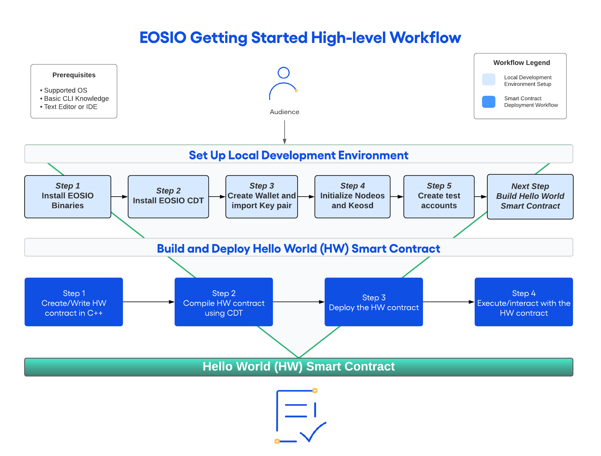

The purpose of the _EOSIO Getting Started Guide_ is to provide guided instructions to set up your local Antelope development environment and use the environment to build and deploy a basic **_Hello World_** Smart Contract. The _Getting Started Guide_ high-level workflow is illustrated in the following diagram: 

The diagram identifies the following two workflows: 

1. **Set up local development environment**
2. **Build and deploy a basic Hello World smart contract**

[[info | Note]]
| Before you begin with the getting started workflow, make sure you familiarize yourself with [Antelope Framework and Toolchain](../20_introduction-to-eosio/10_platform_and_toolchain.md), [Core Concepts](../20_introduction-to-eosio/20_core_concepts.md), and some of the [Technical Features](../20_introduction-to-eosio/30_technical_features.md).

# Set Up Local Development Environment
As a developer, begin with setting up your [local development environment](../30_getting-started-guide/20_local-development-environment/index.md) that involves satisfying system requirements, installing OS-specific Antelope binaries, and creating test blockchain accounts. Once the local development environment is set up, you can progress to smart contracts development workflow and build your first basic **Hello World** smart contract.

[[info | Note]]
| Installing Antelope prebuilt binaries is a convenient method for beginners. If you want to try advanced build methods, see [Installing from Source](https://developers.eos.io/manuals/eos/v2.1/install/build-from-source/index).

# Build and Deploy Hello World Smart Contract
After your local development environment is fully configured, you are ready to build and deploy your first Hello World Smart Contract on the Antelope blockchain framework.

### Use Pre-configured Web Environment
Optionally, you can use a pre-configured web environment as your local development environment without the need of binary installation. Use a pre-configured web environmennt if you have system constraints. See the following items for more information:

* [Antelope Quickstart Web IDE](30_pre-configured-development-environment): Use the Gitpod pre-configured Antelope development environment
* [The Antelope Testnet](../70_quick-start-guides): Use the Antelope Testnet as a testing environment to deploy smart contracts and build blockchain applications on EOSIO.

# Further Reading
The following documentation resources will help you gain advanced technical knowledge and functional understanding of the Antelope framework. Additionally, you can explore advanced configuration options available for development environments.

## Training and Certification 
Developed for [Antelope for Business,](https://eos.io/eosio-for-business/) these comprehensive courses cover the foundations of EOSIO, smart contract programming, application development and security best practices for integrations. The courses are currently available to all the Antelope community. [Sign up for free access until January 31, 2021.](https://training.eos.io/)

## Protocol Guides
In this section, we describe the base components and protocols used in the Antelope framework. `Antelope Core` provides the basic building blocks for the `system` layer and because they are not implemented as smart contracts they do not provide the same level of flexibility. Nevertheless, the `core` implementation is also open source and thus it can be modified as well to suit custom business requirements. Follow this link [Protocol Guides](../60_protocol-guides) to read more about `Antelope Core.`

## Configuration Guides

The configuration guides section will show you how to configure [Nodeos.](../glossary/index/#nodeos) How `Nodeos` is configured will depend on your desired usage. `Nodeos` configuration controls which [plugins](../glossary/index/#plugin) are used and how those `plugins` are configured. The `plugins` are used to specify `Nodeos` behaviour for specific purposes. 

### Smart Contracts and blockchain configuration
The `Antelope framework` provides a blockchain framework and a key feature of the `Antelope framework` is flexibility. Smart Contracts are part of this flexibility. Many features are implemented using smart contracts, and smart contracts can customize blockchain behavior. Some examples are consensus, governance, and resource models. For more information see [eos-system-contracts](https://developers.eos.io/manuals/eos-system-contracts/latest/index) and the [bios boot sequence tutorial.](../80_tutorials/10_bios-boot-sequence.md)    

### Development and Testing
There are several ways to configure a [Nodeos](../glossary/index/#nodeos) environment for development and testing. Which option to use largely depends on what the project goals are. Some practical options are provided below.

#### Local Single-Node Testnet
This runs a blockchain, with a single node, locally. The local single-node testnet is the simplest blockchain configuration. A local single-node testnet is generally used as a test envronment to get started developing smart contracts.    

* [Configure Nodeos as a Local Single-node Testnet](https://developers.eos.io/manuals/eos/v2.1/nodeos/usage/development-environment/local-single-node-testnet) 

#### Local Multi-Node Testnet
A local single node testnet is a great place to start, but a blockchain running on a single node is not much of a blockchain. To run many nodes locally see the guides listed below. Often multi node testnets will be used for advanced development and testing giving a more realistic blockchain environment. Other uses for a a multi node testnet are benchmarking, optimization and experimentation, or to increase your knowledge. 

* [Configure Nodeos as a Local Two-Node Testnet](https://developers.eos.io/manuals/eos/v2.1/nodeos/usage/development-environment/local-multi-node-testnet)
* [Configure Nodeos as a Local 21-Node Testnet](https://github.com/AntelopeIO/leap/blob/master/tutorials/bios-boot-tutorial/README.md)

### Block Producers
Block producers operate in a distributed and/or decentralised environment. A [block producer](../glossary/index/#block-producer) may run many instances of [Nodeos](../glossary/index/#nodeos) and these may be in one of two modes:

 * [Producing Node](https://developers.eos.io/manuals/eos/v2.1/nodeos/usage/node-setups/producing-node)
 * [Non-Producing Node](https://developers.eos.io/manuals/eos/v2.1/nodeos/usage/node-setups/non-producing-node)

`Producing Nodes` are configured for block production. They connect to the peer-to-peer network and actively produce new blocks. Loose transactions are also validated and relayed. On mainnet, `Producing Nodes` only produce blocks if their assigned block producer is part of an active schedule.

`Non-Producing Nodes` connect to the peer-to-peer network but do not actively produce new blocks; they are useful for acting as proxy nodes, relaying API calls, validating transactions, broadcasting information to other nodes, etc. `Non-Producing Nodes` are also useful for monitoring the blockchain state.

### Plugin Guides
Use plugins to extend, or specialize, the behaviour of nodeos and kleosd. See the [Plugins section](https://developers.eos.io/manuals/eos/v2.1/nodeos/plugins/index) to learn more.

## Core Components
The main components of the Antelope framework.
* [nodeos](https://developers.eos.io/manuals/eos/v2.1/nodeos/index) : The core service daemon that runs on every Antelope node.
* [cleos](https://developers.eos.io/manuals/eos/v2.1/cleos/index) : A command line interface to interact with the blockchain and manage wallets.
* [keosd](https://developers.eos.io/manuals/eos/v2.1/keosd/index) : A key manager service daemon for storing private keys and signing digital messages.
* [cdt](https://developers.eos.io/manuals/cdt/v1.8/index) : Contract Development Toolkit is a suite of tools used to build Antelope contracts.
* [eos-system-contracts](https://developers.eos.io/manuals/eos-system-contracts/latest/index) : Smart contracts that provide some of the basic functions of the Antelope blockchain.

