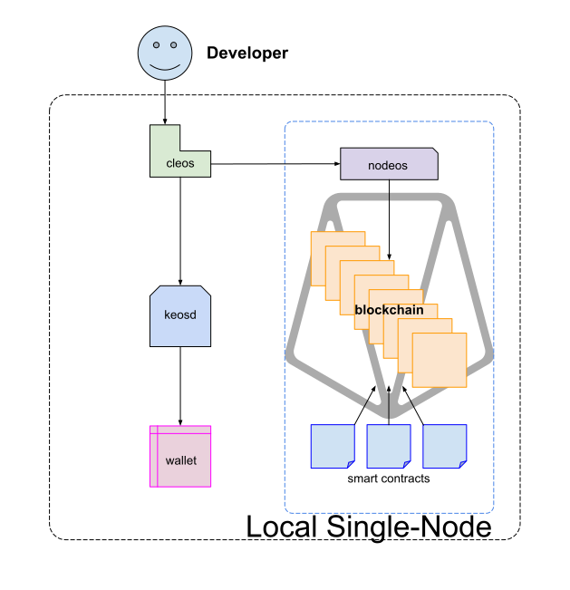

While there are a few steps to installing and configuring a local EOS blockchain node, it is pretty straight forward once you understand the pieces. This guide will walk you through configuring Ubuntu (or other Debian based Linux distributions), installing Antelope Leap, Contract Development Toolkit (CDT), and the EOS Foundation Network's System Contracts, then configuriong everything for a local developmance instance. The process itself only takes a few minutes, but we will explain the parts as we progress through them and point you to additional resources for other options. 

## The Local Node Stack
Running a local node has the following parts
* **Ubuntu** or other Debian based Linux distribution as the operating system. For development purposes this could be a Virtual Machine or even Windows Subsystem for Linux (WSL). 
* **[Antelope Leap](https://github.com/AntelopeIO/leap)** is the C++ implementation of the Antelope protocol. It includes includes multiple parts. In this guide you will learn about `nodeos`, `cleos`, & `keosd` 
    * `nodeos` is the core service daemon that runs on every Antelope node. It can be configured to process smart contracts, validate transactions, produce blocks containing valid transactions, and confirm blocks to record them on the blockchain.
    * `cleos` is a command line tool that interfaces with the REST API exposed by `nodeos`. Developers can also use `cleos` to deploy and test Antelope smart contracts.
    * `keosd` is a key manager service daemon for storing private keys and signing digital messages. It provides a secure key storage medium for keys to be encrypted at rest in the associated wallet file. `keosd` also defines a secure enclave for signing transaction created by `cleos` or a third part library.
    * Other utilities: `trace_api_util` is a command-line interface (CLI) utility that allows node operators to perform low-level tasks associated with the Trace API Plugin. 
* **[Antelope CDT](https://github.com/AntelopeIO/cdt)** is the Contract Development Toolkit. A suite of tools to facilitate C/C++ development of contracts for Antelope blockchains. 
*  **[EOS Foundation Network's System Contracts](https://github.com/eosnetworkfoundation/eos-system-contracts)** are a collection of contracts specifically designed for the EOS blockchain, which implements a lot of critical functionality that goes beyond what is provided by the base Antelope protocol, the protocol on which EOS blockchain is built on.

Antelope Leap and CDT are released as Debian (.deb) packages, so installing from release is easiest with a Ubuntu or Debian based distribution of Linux. It is also possible to build from source on other platforms, but that is beyond the scope of this guide.

## Prerequisites
This was tested on Ubuntu, but should work on equivelent versions of other Ubuntu and Debian derived distributions. Versions tested:
* Ubuntu [22.04.2 LTS](https://releases.ubuntu.com/jammy/) (Jammy Jellyfish)
* Ubuntu [20.04.6 LTS](https://www.releases.ubuntu.com/focal/) (Focal Fossa)
The Long Term Support (LTS) versions of Ubuntu, and included packages, are supported for 5 years with free security updates, as opposed to the 9 months for other releases. Installation may work on the latest Ubuntu 22.10 (Kinetic Kudu), or whatever comes next, but you are on your own for the differences.

## Installation
We are going to create an eos folder in your home directory, and all of our configuration assumes that path is used. We will download the installation files into a temp folder which you can remove later if you like.

We are installing [Leap 4.0.1](https://github.com/AntelopeIO/leap/releases/tag/v4.0.1) and [CDT 3.1.0](https://github.com/AntelopeIO/cdt/releases/tag/v3.1.0) for AMD 64 (x86-64). There is a newer version of CDT, but it isn't compatible with the current [3.1.1 version of the EOS System Contracts](https://github.com/eosnetworkfoundation/eos-system-contracts/releases/tag/v3.1.1). There are also ARM versions of the packages, so be sure you grab the correct architecture for your hardware.
```bash
mkdir ~/eos
mkdir ~/eos/temp
wget https://github.com/AntelopeIO/leap/releases/download/v4.0.1/leap_4.0.1-ubuntu20.04_amd64.deb -O ~/eos/temp/leap_4.0.1-ubuntu20.04_amd64.deb
wget https://github.com/AntelopeIO/cdt/releases/download/v3.1.0/cdt_3.1.0_amd64.deb -O ~/eos/temp/cdt_3.1.0_amd64.deb
sudo apt-get install -y ~/eos/temp/cdt_3.1.0_amd64.deb ~/eos/temp/leap_4.0.0-ubuntu20.04_amd64.deb
```

## Config.ini

## Plugins

## CORS
